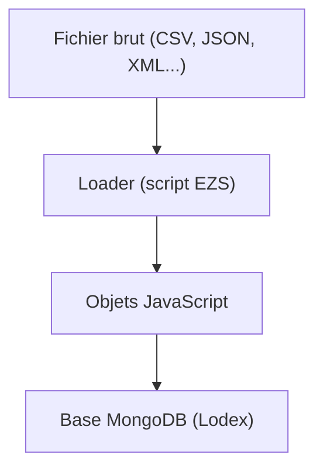

# Traitements avancés dans un loader

## Qu’est-ce qu’un loader dans Lodex ?

Dans **Lodex**, un loader est un fichier de configuration permettant d'importer un jeu de données dans une instance.  

Son rôle est de convertir **un fichier brut** (CSV, JSON, XML, etc.) en un flux d’objets **JavaScript** prêts à être stockés dans **la base MongoDB de Lodex**.  



Un loader s'écrit dans un **fichier `.ini`**.  
- `.ini` = *Initialization file* (fichier d’initialisation).  
- Historiquement, ce format sert à décrire des configurations sous forme texte, avec des **sections** (`[ ]`) et des paires `clé = valeur`.  
- Lodex réutilise ce format pour décrire un **pipeline de transformation**.  

Un fichier `.ini` suit une logique d'étapes : il est lu de haut en bas et est exécuté séquentiellement.  
Chaque section étant une étape du pipeline qui applique une transformation au flux de données avant de le transmettre à la suivante.  

👉 Exemple :  

```ini
[assign]
path = Unpaywall
value = get("Identifiers.DOI")

[swing]
test = get("Unpaywall").isEmpty()
reverse = true

[swing/expand]
path = Unpaywall
size = 100

[swing/expand/URLConnect]
url = https://biblio-tools.services.istex.fr/v2/unpaywall/works/expand
timeout = 3600000
noerror = false
retries = 5
```

🔍 Explications :

```txt
        [assign]    → création du champ "Unpaywall" à partir du champ "DOI"
           │
           ▼
        [swing]     → On teste si le champ est vide (absence de DOI), si c'est le cas on exclue ces données du traitement
           │
           ▼
     [swing/expand]     → On regroupe les données par paquet de 100
           │
           ▼
 [swing/expand/URLConnect]    → On interroge l’API Unpaywall
           │
           ▼
 On récupère les information d'Unpaywall dans notre champ
```

Ce modèle en **pipeline** rend les loaders très **flexibles** : on peut ajouter, retirer ou modifier des étapes sans casser l’ensemble.  

---

Ecrire ses transformations dans un *loader* plutôt que dans **Lodex** en *enrichissements* présente plusieurs avantages :  

- Tout d'abord, **Lodex** fonctionne en **stream** :
  - Lorsqu’on applique des enrichissements, Lodex travaille par paquets.  
  - Chaque paquet est transformé, envoyé dans MongoDB, puis relu pour passer à l’étape suivante.
  - Cela provoque de nombreux allers-retours entre Lodex et MongoDB, ce qui rallonge les temps de traitement.
- Un loader agit différemment :
  - Le fichier est lu et transformé étape par étape dans le pipeline EZS.  
  - Toutes les transformations sont effectuées **avant** l’écriture en base.
  - Puis le flux final d’objets JavaScript est envoyé en une seule fois à MongoDB.
- Et surtout, un loader permet de réaliser des opérations impossibles ou limitées dans Lodex:
  - **Lodex** traite chaque "notice" indépendamment (*ou ligne par ligne)*.
  - Un loader peut lire et transformer tout le dataset à la fois, ce qui rend possibles des opérations globales comme :
    - dédoublonner des lignes entières (*notices identiques*),
    - fusionner des données,
    - ou appliquer des transformations lourdes sur l’ensemble.  

📌 **En résumé, Lodex traite les données ligne par ligne et nous pousse à raisonner notice par notice, tandis qu’un loader permet de réfléchir en termes d’opérations globales sur l’ensemble du dataset, ce qui en augmente considérablement le potentiel de transformation.**

---

Pour qu'un loader fonctionne correctement, il faut inclure des instructions **EZS** spécifiques (comme `[unpack]`, `[identify]`, `[OBJFlatten]`…) et déclarer des *plugins*, mais ce n'est pas l'objet de cette documentation.  

Ces aspects techniques relèvent davantage d’une formation dédiée à **EZS**, ça tombe bien ! Mon collègue François Parmentier en a justement fait une [ici](https://github.com/parmentf/formation-ezs/tree/master).  

Nous allons nous concentrer ici sur un ensemble restreint d’instructions essentielles pour transformer et nettoyer les données avec Lodash.  

## Les instructions EZS

### [assign]

`[assign]` permet d'affecter une valeur à un champ de l'objet courant. Si le champ existe déjà, sa valeur est écrasée, sinon il est créé.

```json
[{
    "DO": "10.3390/info10050178 ",
    "TI": "Istex: A Database of Twenty Million Scientific Papers with a Mining Tool Which Uses Named Entities",
    "SO": "Information"
}]
```

```js
[assign]
path = doi
value = get("DO")
```

:point_down:

```json
[{
    "DO": "10.3390/info10050178 ",
    "TI": "Istex: A Database of Twenty Million Scientific Papers with a Mining Tool Which Uses Named Entities",
    "SO": "Information",
    "doi": "10.3390/info10050178 "
}]
```

Dans un `[assign]`, on peut créer autant de nouveaux champs que l’on veut, tant qu’ils s’appuient uniquement sur les champs existants du dataset original.  

On peut donc les définir dans le même bloc `[assign]`.

```js
[assign]
path = doi
value = get("DO")

path = normalizedTitle
value = get("TI").deburr().toLower()

path = normalizedSource
value = get("SO").deburr().toLower()
```

⚠️ Attention :  

Un champ créé dans un `[assign]` n’est pas utilisable immédiatement dans ce même bloc.  
Il ne devient disponible qu’à la sortie du bloc, c’est-à-dire pour les instructions suivantes.  

Si l'on souhaite créer un champ contenant le doi ou, s'il n'existe pas, le titre normalisé, on ne peut ajouter ceci dans le bloc :

```js
path = doiOrNormalizedTitle
value = get("doi").thru(doi => _.isEmpty(doi) ? self.normalizedTitle : doi)
```

Il faut ouvrir un nouvel `[assign]`

```js
[assign]
path = doiOrNormalizedTitle
value = get("doi").thru(doi => _.isEmpty(doi) ? self.normalizedTitle : doi)
```

Résultat :

```json
[{
    "DO": "10.3390/info10050178 ",
    "TI": "Istex: A Database of Twenty Million Scientific Papers with a Mining Tool Which Uses Named Entities",
    "SO": "Information",
    "doi": "10.3390/info10050178 ",
    "normalizedTitle": "istex: a database of twenty million scientific papers with a mining tool which uses named entities",
    "normalizedSource": "information",
    "doiOrNormalizedTitle": "10.3390/info10050178 "
}]
```

🔑 **À retenir : `[assign]` permet d’ajouter de nouveaux champs ou de modifier des champs existants (s’ils portent le même nom), tout en conservant l’objet original.**  
**On enrichit donc ce dernier, au lieu de le remplacer.**

---

### [replace]

On a vu que l’on pouvait modifier des valeurs ou ajouter de nouveaux champs avec `[assign]`, ce qui permet d’enrichir l’objet tout en conservant ses données originales.  

Mais il arrive qu’on trouve les noms de champs du dataset peu intelligibles (DO, TI, SO...) ou pas adaptés à nos besoins. Plutôt que d'empiler des `[assign]` puis de supprimmer les champs originaux ensuite, il faut utiliser `[replace]` qui permet de reconstruire un objet en lieu et place de l'original.  

Ainsi : 

```js
[replace]
path = doi
value = get("DO")

path = normalizedTitle
value = get("TI").deburr().toLower()

path = normalizedSource
value = get("SO").deburr().toLower()
```

retourne :

```json
[{
    "doi": "10.3390/info10050178 ",
    "normalizedTitle": "istex: a database of twenty million scientific papers with a mining tool which uses named entities",
    "normalizedSource": "information"
}]
```

L’instruction `[replace]` permet de **remplacer complètement l’objet courant** par un nouveau que l'on définit dans le même bloc.  

Si l’on veut créer un champ supplémentaire à partir de l’objet déjà modifié, comme dans l'exemple d'`[assign]` avec *doiOrNormalizedTitle* attention au piège !

Il faudra ici ajouter `[assign]` pour créer le champ *doiOrNormalizedTitle* et non pas `[replace]`.  

Si l'on ouvre un nouveau bloc `[replace]`, il va remplacer celui que l'on avait créé juste avant :

```js
[replace]
path = doi
value = get("DO")

path = normalizedTitle
value = get("TI").deburr().toLower()

path = normalizedSource
value = get("SO").deburr().toLower()

[replace]
path = doiOrNormalizedTitle
value = get("doi").thru(doi => _.isEmpty(doi) ? self.normalizedTitle : doi)
```

:point_down:

```json
[{
    "doiOrNormalizedTitle": "10.3390/info10050178 "
}]
```

`[replace]` n'est donc pas cumulatif comme l'est `[assign]`.

🔑 **À retenir : [replace] reconstruit un objet neuf en remplaçant complètement l’objet courant. Tous les champs non explicitement redéfinis disparaissent.**

---

### [exchange]

`[exchange]` est souvent difficile à différencier de `[assign]` ou `[replace]`, on pourrait dire qu'il se situe un peu entre les deux.  
Lui aussi remplace l'objet entier, mais le contenu du nouvel objet est transformé à partir de l'objet courant.  

Un exemple simple :

```json
[
  { "nom": "un", "valeur": 1 },
  { "nom": "deux", "valeur": 2 }
]
```

```js
[exchange]
value = get("nom")
```

Sortie :  

```js
["un","deux"]
```

Ici, chaque objet est remplacé par sa valeur du champ *nom*.  

Combiné à **Lodash** `[exchange]` peut avoir d'autres utilités, comme supprimer des clés d'un objet, ce qui en d'autres termes signifie **retirer des colonnes indésirables de son dataset.**

```json
[
  { "nom": "un", "valeur": 1 },
  { "nom": "deux", "valeur": 2 }
]
```

```js
[exchange]
value = omit("valeur")
```

Sortie :  

```js
[
  { "nom": "un" },
  { "nom": "deux" }
]
```

> [!TIP]
> Pour supprimer plusieurs colonnes ou champs en même temps, on met simplement la liste des champs inésirables dans un tableau.
> ```js
> [exchange]
> value = omit(["colonneX","colonneY","colonneZ"])
> ```

Plus puissant encore, là ou `[assign]` permettait de d'ajouter ou de créer des champs un par un, `[exchange]` permet d'agir sur **l'objet entier** et donc de réaliser des **transformations globales**.  

Un cas d'usage pour illustrer, où l'on souhaitait réaliser la même transformation sur 10 colonnes du dataset. A savoir, verbaliser des booléens en remplacant *true* par *disponible* et *false* par *non disponible*.

```json
[
  {
    "publication_title": "Cancer Research",
    "publication_type": "serial",
    "IN2P3": true,
    "INC": false,
    "INEE": true,
    "INP": false,
    "INS2I": true,
    "INSB": false,
    "INSHS": true,
    "INSIS": false,
    "INSMI": true,
    "INSU": false,
    "type_acces": "accès acquis"
  }
]
```

```js
[exchange]
value = self().mapValues((value, key) => \
    ['IN2P3', 'INC', 'INEE', 'INP', 'INS2I', 'INSB', 'INSHS', 'INSIS', 'INSMI', 'INSU'].includes(key) \
        ? value === true ? 'disponible' : 'non disponible' \
        : value \
)
```

:point_down:

```json
[
  {
    "publication_title": "Cancer Research",
    "publication_type": "serial",
    "IN2P3": "disponible",
    "INC": "non disponible",
    "INEE": "disponible",
    "INP": "non disponible",
    "INS2I": "disponible",
    "INSB": "non disponible",
    "INSHS": "disponible",
    "INSIS": "non disponible",
    "INSMI": "disponible",
    "INSU": "non disponible",
    "type_acces": "accès acquis"
  }
]
```

On a donc conservé notre objet complet : toutes les clés sélectionnées ont vu leurs valeurs transformées et les autres clés sont restées inchangées.  

Décomponsons le script :

- `self()` permet de récupérer l'objet dans son intégralité.
- `.mapValues((value, key) => … )` permet de parcourir toutes les clés de l'objet et d'appliquer une fonction à chaque paire clé/valeur par `=>`.
- `.includes(key)` est une **condition logique** qui vérifié si la clé en cours appartient à la liste (des instituts)
  - si la clé appartient à la liste alors on applique à la valeur la transformation `value === true ? 'disponible' : 'non disponible'`
  - ou si la clé n'appartient pas à la liste, on laisse la valeur telle quelle par `: value`.

Vous l'aurez compris, combiner l'instruction **EZS** `[exchange]` avec des fonctions **Lodash** ouvre la voie à des **transformations globales, nombreuses et variées** que nous ne détaillerons pas plus ici mais dans les scripts avancés et cas d'usage.  

---
 
### [remove]

`[remove]` permet de supprimer entèrement certains éléments du flux en fonction d’une condition. Les objets qui ne satisfont pas le test sont écartés et ne passent pas à l’étape suivante.  

Autrement dit, dans le contexte de **Lodex** cela permet de supprimer des **lignes entières**.

```json
[
  { "id": 1, "type": "article" },
  { "id": 2, "type": "book chapter" },
  { "id": 3, "type": "preprint" },
  { "id": 4, "type": "article" }
]
```

```js
[remove]
test = get("type").isEqual("preprint")
```

On souhaite ici supprimer les objets dont le `type` est "preprint".

```json
[{
    "id": 1,
    "type": "article"
},
{
    "id": 2,
    "type": "book chapter"
},
{
    "id": 4,
    "type": "article"
}]
```

Si l'on souhaitait conserver uniquement le `type` "article", soit supprimer tout sauf "article", il suffit d'inverser le test.

```js
[remove]
test = get("type").isEqual("article")
reverse = true
```

```json
[{
    "id": 1,
    "type": "article"
},
{
    "id": 4,
    "type": "article"
}]
```

---


### [dedupe]

Supprime les objets qui sont **considérés comme identiques**.  

Par défaut `[dedupe]` agit sur le champ `uri`.  
Cela signifie qu'il ne supprime pas automatiquement des objets identiques en tout point, il faut toujours réfléchir au bon critère de dédoublonnage.  

Ici on veut dédoublonner des notices bibliographiques en se basant sur le DOI :

```json
[
  { "doi": "10.123/abc", "title": "A" },
  { "doi": "10.456/def", "title": "B" },
  { "doi": "10.123/abc", "title": "A" }
]
```

```js
[dedupe]
path = doi
ignore = true
```

```json
[{
    "doi": "10.123/abc",
    "title": "A"
},
{
    "doi": "10.456/def",
    "title": "B"
}]
```

⚠️ Il est impératif de mettre `ignore = true`. Par défaut le paramètre `ignore` est `false`, il stoppe alors le flux de traitements dès qu'un doublon est rencontré :  
`item #3 [dedupe] <Error: Duplicate identifier: 10.123/abc already exists>`  
`ignore = true` permet de ne garder que le 1er élément parmi ceux qui sont identiques et de poursuivre le flux de traitements.  

Si le dataset n’a pas d’identifiant unique fiable, on peut vouloir comparer l’intégralité de l’objet pour détecter les doublons.  
Cette approche est plus complexe (parce qu’on doit comparer toutes les clés et valeurs de l’objet), et sera donc présentée dans le chapitre suivant.  

---

### [exploding]

L’instruction `[exploding]` permet de démultiplier les éléments d’un tableau contenu dans un champ en plusieurs lignes.  
Chaque valeur contenue dans le tableau devient alors une ligne indépendante.  

Elle prend deux paramètres :

- `id` : le champ qui sert « d’identifiant » et reste inchangé
- `value` : le champ qui contient un tableau et qui sera « explosé »


```json
[
  {
    "title": "Exploring OpenAlex",
    "keywords": ["OpenAlex", "bibliométrie", "CNRS"]
  }
]
```

Dans cet exemple on veut obtenir autant de lignes qu'il y a de mots-clés, tout en gardant le lien entre un mot clé et le titre de la publication dont il est issu.  

```js
[exploding]
id = title
value = keywords
```

:point_down:

```json
[{
    "id": "Exploring OpenAlex",
    "value": "OpenAlex"
},
{
    "id": "Exploring OpenAlex",
    "value": "bibliométrie"
},
{
    "id": "Exploring OpenAlex",
    "value": "CNRS"
}]
```

Cela fonctionne de cette façon pour un jeux de données composé de deux champs seulement. S'il y en a plus, et c'est souvent le cas, il faut restructurer l'objet avant et après `[exploding]`.

```json
[
  {
    "title": "Exploring OpenAlex",
    "doi": "10.212121",
    "keywords": ["OpenAlex", "bibliométrie", "CNRS"]
  }
]
```

```js
[replace]
path = id
value = self().omit("keywords")
// pour conserver tous les autres champs on les regroupe dans id. On enlève keywords pour ne pas l'avoir en double.

path = value
value = get("keywords")
// On assigne keywords à value pour qu'il soit "explosé".

[exploding]
id = id
value = value
```

Ici notre dataset a bien été démultiplié en autant de "keywords" qu'il y en a mais on récupère un objet avec seulement deux champs `id` et `value`.

```json
[{
    "id": {
      "title": "Exploring OpenAlex",
        "doi": "10.212121"
    },
    "value": "OpenAlex"
},
{
  "id": {
    "title": "Exploring OpenAlex",
        "doi": "10.212121"
    },
    "value": "bibliométrie"
},
{
  "id": {
    "title": "Exploring OpenAlex",
        "doi": "10.212121"
    },
    "value": "CNRS"
}]
```
De façon plus visuelle : 

| id (objet regroupé) | value |
|---------------------|-------|
| `{ "title": "Exploring OpenAlex", "doi": "10.212121" }` | OpenAlex |
| `{ "title": "Exploring OpenAlex", "doi": "10.212121" }` | bibliométrie |
| `{ "title": "Exploring OpenAlex", "doi": "10.212121" }` | CNRS |

Il faudrait donc pouvoir "déballer" tous les champs contenus dans `id` afin d'en faire des colonnes dans **Lodex**.  
Pour cela on utilisera l'instruction `[exchange]` avec un peu de Lodash.

```js
[exchange]
value = self() \
    .assign({keyword: self.value}) \
    .assign(self.id) \
    .omit(["id", "value"])  

```

- `assign({ keyword: self.value })` → on crée une nouvelle clé `keyword` avec le contenu de `value`
- `assign(self.id)` → on ajoute les champs contenus dans `id` (ici `title` et `doi`)

A ce stade, notre dataset se compose désormais de 5 clés : `id`, `value`, `keyword`, `title` et `doi`. Ne reste plus qu'à supprimer `id` et `value`.
 
- `omit(["id", "value"])`  

On obtient bien un "dataset" de 3 objets (3 lignes), composés de 3 clés (3 colonnes).  

:point_down:

```json
[{
    "keyword": "OpenAlex",
    "title": "Exploring OpenAlex",
    "doi": "10.212121"
},
{
    "keyword": "bibliométrie",
    "title": "Exploring OpenAlex",
    "doi": "10.212121"
},
{
    "keyword": "CNRS",
    "title": "Exploring OpenAlex",
    "doi": "10.212121"
}]
```

---

### [aggregate]

Cette instruction permet d'agréger des objets, autrement dit de fusionner des lignes d'après un critère précis.  

Manipuler `[aggregate]` s'avère plus complexe que les autres instructions **EZS** vues précédemment.  

Allons-y pas à pas : 

```json
[
  { "doi": "10.1/abc", "dataBaseId": "WOS", "title": "bla bla bla" },
  { "doi": "10.1/abc", "dataBaseId": "OpenAlex", "title": "bla bla bla" },
  { "doi": "10.2/def", "dataBaseId": "HAL", "title": "bla bla" }
]
```

On souhaite ici fusionner les lignes ayant un *doi* en commun, tout en conservant toutes les informations propres aux autres champs.  

> [!WARNING] 
> `[aggregate]` ne fonctionne qu'avec une paire `id`/`value` où `id` sera le critère d'agrégation et `value` les données agrégées.  

Il faut donc commencer par transformer notre dataset en une paire `id`/`value` :

```js
[replace]
path = id
value = get("doi")

path = value
value = self()
```

On remplace donc notre dataset original composé de 3 clés en assignant la valeur du champ `doi` à `id` et en regroupant l'ensemble du dataset(`self`) dans `value`.

```json
[{
  "id": "10.1/abc",
    "value": {
      "doi": "10.1/abc",
        "dataBaseId": "WOS",
        "title": "bla bla bla"
    }
},
{
  "id": "10.1/abc",
    "value": {
      "doi": "10.1/abc",
        "dataBaseId": "OpenAlex",
        "title": "bla bla bla"
    }
},
{
  "id": "10.2/def",
    "value": {
      "doi": "10.2/def",
        "dataBaseId": "HAL",
        "title": "bla bla"
    }
}]
```

On peut maintenant faire notre agrégation en ajoutant : 

```js
[aggregate]
path = id
```

L'agrégation fonctionne bien mais l'objet final demanderait à être restructuré. Si chaque identifiant id est bien unique, la clé value contient simplement un tableau des objets regroupés.

```json
[{
  "id": "10.1/abc",
    "value": [
      {
        "doi": "10.1/abc",
            "dataBaseId": "WOS",
            "title": "bla bla bla"
        },
        {
          "doi": "10.1/abc",
            "dataBaseId": "OpenAlex",
            "title": "bla bla bla"
        }
    ]
},
{
  "id": "10.2/def",
    "value": [
      {
        "doi": "10.2/def",
            "dataBaseId": "HAL",
            "title": "bla bla"
        }
    ]
}]
```

`[aggregate]` ne fusionne pas les champs, il les juxtapose.  

Pour "fusionner" les lignes il faut donc ajouter quelques instructions pour restructurer le tableau : 

```js
[replace]

; Tous les champs étant dans un tableau value, il convient de mapper toutes les clés

path = doi
value = get("value").map("doi").first()
; S'il y a plusieurs doi, ils seront forcément identiques, on peut donc forcer une chaîne avec first

path = dataBaseId
value = get("value").map("dataBaseId")

path = title
value = get("value").map("title")
```

On récupère bien un résultat final conforme et bien structuré : 

```json
[{
  "doi": "10.1/abc",
    "dataBaseId": [
      "WOS",
        "OpenAlex"
    ],
    "title": [
      "bla bla bla",
        "bla bla bla"
    ]
},
{
  "doi": "10.2/def",
    "dataBaseId": [
      "HAL"
    ],
    "title": [
      "bla bla"
    ]
}]
```

> [!TIP]
> On peut ajouter des transformations afin de savoir ce qui a été agrégé et en quelle quantité.

```js
path = isAggregated
value = get("value").size().thru(numb=>numb===1 ? "Non agrégé" : "Agrégé")

path = worksNumber
value = get("value").size()
```

Ces 2 champs nous informeront sur quelles lignes ont été agrégées ou non, ainsi que le nombre de lignes agrégées en une seule.  

```json
[{
  "doi": "10.1/abc",
    "dataBaseId": [
      "WOS",
        "OpenAlex"
    ],
    "title": [
      "bla bla bla",
        "bla bla bla"
    ],
    "isAggregated": "Agrégé",
    "worksNumber": 2
}]
```

> [!WARNING] 
> Si une ligne n’a pas de valeur pour le champ qui sert d'`id` (ici le doi), alors elle est purement et simplement supprimée du flux !!!

Pour éviter cela on doit générer une valeur de repli (fallback), mais qui doit nécessairement être unique. Sinon tous les objets sans doi seront agrégés en un seul.  

On utilisera donc ceci :  
`_.now().toString(36) + Math.random().toString(36).substr(2)`  

On renvoie la date en millisecondes, que l'on convertit en base 36, on y ajoute un nombre flottant entre 0 et 1, on convertit de nouveau en base 36 puis on enlève "0.". Cela donne des `id` de ce type :  

```json
[
{    "id": "mfu5iwtr933w2udkp7q"},
{    "id": "mfu5iwtry8lsbtri68"},
{    "id": "mfu5iwtstvs86nojdmj"},
{    "id": "mfu5iwtsa6dx1m8clh7"}
]
```

On peut placer ces fonctions directement sur le champ `id` ce qui donne un script final comme ceci :  

```js
[replace]
path = id
value = get("doi").thru(doi =>doi === ""? _.now().toString(36) + Math.random().toString(36).substr(2): doi)

path = value
value = self()

[aggregate]
path = id

[replace]

path = doi
value = get("value").map("doi").first()

path = dataBaseId
value = get("value").map("dataBaseId")

path = title
value = get("value").map("title")

path = isAggregated
value = get("value").size().thru(numb=>numb===1 ? "Non agrégé" : "Agrégé")

path = worksNumber
value = get("value").size()
```

> [!TIP]
> On verra dans les [Scripts avancés et cas d'usage](https://github.com/AnaelKremer/Atelier-Lodash-usage-Lodex/blob/main/11-cas-dusage.md) comment combiner les instructions `[exploding]` et `[aggregate]`.

---

### [env] Définir des fonctions réutilisables

On a déjà vu qu'avec l'instruction `[ENV]` il était possible de stocker un dictionnaire que l'on pouvait réutiliser.  

De la même manière, `[ENV]` peut contenir des **fonctions utilitaires**, que l'on définit une fois et que l'on réutilise ensuite à plusieurs endroits du pipeline.  

Par exemple, on a un jeu de données qui va contenir beaucoup de *booléens* (is openacces, has repository, is retracted etc). Dans Lodex on souhaiterait afficher des "Oui" ou "Non" plutôt que les *booléens*.  

On va d'abord écire notre fonction dans `[ENV]` et la nommer correctement (c'est souvent la partie la plus compliquée).

```js
[env]
path = labelizeBoolean
value = fix((bool)=> bool === true ? "Oui" : bool === false ? "Non" : "Inconnu")
```

On utilise `fix` pour déclarer notre fonction, puis on écrit une simple *ternaire*.  

Il suffit ensuite dans un `[assign]` de déclarer le champ que l'on veut transformer, puis d'appeler la *variable d'environnement* dans un `thru`.

```js
[assign]
path = value
value = get("isRetracted").thru(env("labelizeBoolean"))
// Entrée : true → Sortie : "Oui"
```

Et si notre champ ne contient pas un seul, mais plusieurs *booléens* dans un tableau, il suffit de remplacer `thru` par `map` !

```js
[assign]
path = value
value = get("isCnrs").map(env("labelizeBoolean"))
// Entrée :  [false, true, true, false] → Sortie : ["Non","Oui","Oui","Non"]
```

Une fois cette logique acquise, on peut aller encore plus loin et se lancer dans **la composition de fonctions**.  

Plutôt que d’écrire de longs traitements redondants, on crée de petites briques spécialisées (nettoyer une chaîne, nettoyer un tableau), puis on les enchaîne et les combine pour construire des transformations plus complexes.  

---

A titre d'exemple, on souhaite "normaliser" les champs contenant des chaînes de caractères (titre, résumé...). On souhaite également réaliser ces opérations sur les éléments de certains tableaux comme les mots clés. Et enfin on souhaite que données sous formes de tableaux soient dédoublonnées, triées et vidées de leurs valeurs falsy (null, ""...).  

On construit notre première brique : 

```js
[env]
path = normalizeString
value = fix((str)=> \
  _.toLower( \
    _.deburr( \
      _.trim(str) \
    ) \
  ) \
)
```

> [!NOTE]
> On le sait, utiliser `=>` nous fait passer dans du **JavaScript pur**.  
> Mais pour réaliser un chaînage **Lodash** dans une fonction anonyme il convient de mettre le préfixe `_` avant chaque fonction comme ici.  
> Mais lorsque l'on combine des fonctions, la lecture peut devenir difficile. Dans cet exemple, `trim` est d'abord utilisée, puis `deburr` et enfin `toLower`.
>
> Il existe une autre façon de déclarer un chaînage, qui est sans doute plus lisible :
>
> Il faut placer la valeur à transformer dans un **wrapper Lodash**. Littéralement cela signifie que l'on *emballe* la valeur dans un objet spécial afin de pouvoir la passer dans un pipeline de transformations.  
> Et comme vu [ici](https://github.com/AnaelKremer/Atelier-Lodash-usage-Lodex/blob/main/01-introduction.md#un-encha%C3%AEnement-de-fonctions-lodash) un pipeline **Lodash** doit commencer par `_.chain` et se conclure par `.value()`.

On peut donc écrire notre première brique comme cela :

```js
[env]
path = normalizeString
value = fix((str)=> \
  _.chain(str) \
    .trim() \
    .deburr() \
    .toLower() \
    .value() \
)
```

Puis la tester sur une chaîne de caractères :

```js
[assign]
path = normalizedTitle
value = get("value.title").thru(env("normalizeString"))
// Entrée :  "Bibliométrie prête à l'emploi avec OpenAlex : retour d'expérience" 
// → Sortie : "bibliometrie prete a l'emploi avec openalex : retour d'experience"
```

On peut ensuite créer notre deuxième brique destinée à traiter des tableaux (que l'on ajoute dans [ENV] en dessous de la première) :

```js
path = cleanArray
value = fix((arr) => \
  _.chain(arr) \
    .compact() \
    .uniq() \
    .sort() \
    .value() \
)
```

On peut enfin utiliser nos deux briques sur un même champ :

```js
path = normalizedAllKeywords
value = get("value.authorsKeywords") \
    .concat(self.value.keywords) \
    .map(env("normalizeString")) \
    .thru(env("cleanArray"))
```

:point_down:

```json
{
  "authorsKeywords": [
    "bibliométrie",
    "openalex",
    "cnrs-inist",
    "retour d’expérience"
  ],
  "keywords": [
    "bibliometrie",
    "OpenAlex",
    "CNRS-INIST",
    "expérience utilisateur",
    "Lodex"
  ],
  "normalizedAllKeywords": [
    "bibliometrie",
    "cnrs-inist",
    "experience utilisateur",
    "lodex",
    "openalex",
    "retour d’experience"
  ]
}
```