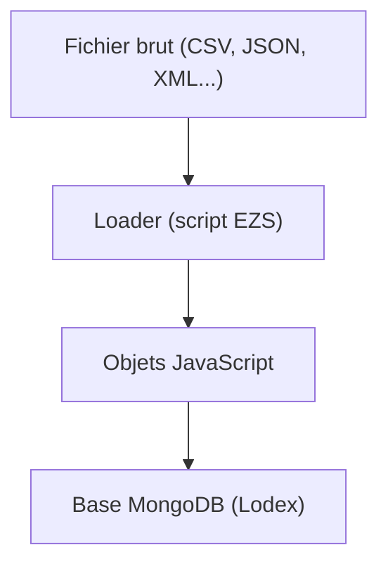

# Traitements avancés dans un loader

## Qu’est-ce qu’un loader dans Lodex ?

Dans **Lodex**, un loader est un fichier de configuration permettant d'importer un jeu de données dans une instance.  

Son rôle est de convertir **un fichier brut** (CSV, JSON, XML, etc.) en un flux d’objets **JavaScript** prêts à être stockés dans **la base MongoDB de Lodex**.  



Un loader s'écrit dans un **fichier `.ini`**.  
- `.ini` = *Initialization file* (fichier d’initialisation).  
- Historiquement, ce format sert à décrire des configurations sous forme texte, avec des **sections** (`[ ]`) et des paires `clé = valeur`.  
- Lodex réutilise ce format pour décrire un **pipeline de transformation**.  

Un fichier `.ini` suit une logique d'étapes : il est lu de haut en bas et est exécuté séquentiellement.  
Chaque section étant une étape du pipeline qui applique une transformation au flux de données avant de le transmettre à la suivante.  

👉 Exemple :  

```ini
[assign]
path = Unpaywall
value = get("Identifiers.DOI")

[swing]
test = get("Unpaywall").isEmpty()
reverse = true

[swing/expand]
path = Unpaywall
size = 100

[swing/expand/URLConnect]
url = https://biblio-tools.services.istex.fr/v2/unpaywall/works/expand
timeout = 3600000
noerror = false
retries = 5
```

🔍 Explications :

```txt
        [assign]    → création du champ "Unpaywall" à partir du champ "DOI"
           │
           ▼
        [swing]     → On teste si le champ est vide (absence de DOI), si c'est le cas on exclue ces données du traitement
           │
           ▼
     [swing/expand]     → On regroupe les données par paquet de 100
           │
           ▼
 [swing/expand/URLConnect]    → On interroge l’API Unpaywall
           │
           ▼
 On récupère les information d'Unpaywall dans notre champ
```

Ce modèle en **pipeline** rend les loaders très **flexibles** : on peut ajouter, retirer ou modifier des étapes sans casser l’ensemble.  

---

Ecrire ses transformations dans un *loader* plutôt que dans **Lodex** en *enrichissements* présente plusieurs avantages :  

- Tout d'abord, **Lodex** fonctionne en **stream** :
  - Lorsqu’on applique des enrichissements, Lodex travaille par paquets.  
  - Chaque paquet est transformé, envoyé dans MongoDB, puis relu pour passer à l’étape suivante.
  - Cela provoque de nombreux allers-retours entre Lodex et MongoDB, ce qui rallonge les temps de traitement.
- Un loader agit différemment :
  - Le fichier est lu et transformé étape par étape dans le pipeline EZS.  
  - Toutes les transformations sont effectuées **avant** l’écriture en base.
  - Puis le flux final d’objets JavaScript est envoyé en une seule fois à MongoDB.
- Et surtout, un loader permet de réaliser des opérations impossibles ou limitées dans Lodex:
  - **Lodex** traite chaque "notice" indépendamment (*ou ligne par ligne)*.
  - Un loader peut lire et transformer tout le dataset à la fois, ce qui rend possibles des opérations globales comme :
    - dédoublonner des lignes entières (*notices identiques*),
    - fusionner des données,
    - ou appliquer des transformations lourdes sur l’ensemble.  

📌 **En résumé, Lodex traite les données ligne par ligne et nous pousse à raisonner notice par notice, tandis qu’un loader permet de réfléchir en termes d’opérations globales sur l’ensemble du dataset, ce qui en augmente considérablement le potentiel de transformation.**

---

Pour qu'un loader fonctionne correctement, il faut inclure des instructions **EZS** spécifiques (comme `[unpack]`, `[identify]`, `[OBJFlatten]`…) et déclarer des *plugins*, mais ce n'est pas l'objet de cette documentation.  

Ces aspects techniques relèvent davantage d’une formation dédiée à **EZS**, ça tombe bien ! Mon collègue François Parmentier en a justement fait une [ici](https://github.com/parmentf/formation-ezs/tree/master).  

Nous allons nous concentrer ici sur un ensemble restreint d’instructions essentielles pour transformer et nettoyer les données avec Lodash.  

## Les instructions EZS

### [assign]

`[assign]` permet d'affecter une valeur à un champ de l'objet courant. Si le champ existe déjà, sa valeur est écrasée, sinon il est créé.

```json
[{
    "DO": "10.3390/info10050178 ",
    "TI": "Istex: A Database of Twenty Million Scientific Papers with a Mining Tool Which Uses Named Entities",
    "SO": "Information"
}]
```

```js
[assign]
path = doi
value = get("DO")
```

:point_down:

```json
[{
    "DO": "10.3390/info10050178 ",
    "TI": "Istex: A Database of Twenty Million Scientific Papers with a Mining Tool Which Uses Named Entities",
    "SO": "Information",
    "doi": "10.3390/info10050178 "
}]
```

Dans un `[assign]`, on peut créer autant de nouveaux champs que l’on veut, tant qu’ils s’appuient uniquement sur les champs existants du dataset original.  

On peut donc les définir dans le même bloc `[assign]`.

```js
[assign]
path = doi
value = get("DO")

path = normalizedTitle
value = get("TI").deburr().toLower()

path = normalizedSource
value = get("SO").deburr().toLower()
```

⚠️ Attention :  

Un champ créé dans un `[assign]` n’est pas utilisable immédiatement dans ce même bloc.  
Il ne devient disponible qu’à la sortie du bloc, c’est-à-dire pour les instructions suivantes.  

Si l'on souhaite créer un champ contenant le doi ou, s'il n'existe pas, le titre normalisé, on ne peut ajouter ceci dans le bloc :

```js
path = doiOrNormalizedTitle
value = get("doi").thru(doi => _.isEmpty(doi) ? self.normalizedTitle : doi)
```

Il faut ouvrir un nouvel `[assign]`

```js
[assign]
path = doiOrNormalizedTitle
value = get("doi").thru(doi => _.isEmpty(doi) ? self.normalizedTitle : doi)
```

Résultat :

```json
[{
    "DO": "10.3390/info10050178 ",
    "TI": "Istex: A Database of Twenty Million Scientific Papers with a Mining Tool Which Uses Named Entities",
    "SO": "Information",
    "doi": "10.3390/info10050178 ",
    "normalizedTitle": "istex: a database of twenty million scientific papers with a mining tool which uses named entities",
    "normalizedSource": "information",
    "doiOrNormalizedTitle": "10.3390/info10050178 "
}]
```

🔑 **À retenir : `[assign]` permet d’ajouter de nouveaux champs ou de modifier des champs existants (s’ils portent le même nom), tout en conservant l’objet original.**  
**On enrichit donc ce dernier, au lieu de le remplacer.**

---

### [replace]

On a vu que l’on pouvait modifier des valeurs ou ajouter de nouveaux champs avec `[assign]`, ce qui permet d’enrichir l’objet tout en conservant ses données originales.  

Mais il arrive qu’on trouve les noms de champs du dataset peu intelligibles (DO, TI, SO...) ou pas adaptés à nos besoins. Plutôt que d'empiler des `[assign]` puis de supprimmer les champs originaux ensuite, il faut utiliser `[replace]` qui permet de reconstruire un objet en lieu et place de l'original.  

Ainsi : 

```js
[replace]
path = doi
value = get("DO")

path = normalizedTitle
value = get("TI").deburr().toLower()

path = normalizedSource
value = get("SO").deburr().toLower()
```

retourne :

```json
[{
    "doi": "10.3390/info10050178 ",
    "normalizedTitle": "istex: a database of twenty million scientific papers with a mining tool which uses named entities",
    "normalizedSource": "information"
}]
```

L’instruction `[replace]` permet de **remplacer complètement l’objet courant** par un nouveau que l'on définit dans le même bloc.  

Si l’on veut créer un champ supplémentaire à partir de l’objet déjà modifié, comme dans l'exemple d'`[assign]` avec *doiOrNormalizedTitle* attention au piège !

Il faudra ici ajouter `[assign]` pour créer le champ *doiOrNormalizedTitle* et non pas `[replace]`.  

Si l'on ouvre un nouveau bloc `[replace]`, il va remplacer celui que l'on avait créé juste avant :

```js
[replace]
path = doi
value = get("DO")

path = normalizedTitle
value = get("TI").deburr().toLower()

path = normalizedSource
value = get("SO").deburr().toLower()

[replace]
path = doiOrNormalizedTitle
value = get("doi").thru(doi => _.isEmpty(doi) ? self.normalizedTitle : doi)
```

:point_down:

```json
[{
    "doiOrNormalizedTitle": "10.3390/info10050178 "
}]
```

`[replace]` n'est donc pas cumulatif comme l'est `[assign]`.

🔑 **À retenir : [replace] reconstruit un objet neuf en remplaçant complètement l’objet courant. Tous les champs non explicitement redéfinis disparaissent.**

---

### [exchange]
### [remove]
### [dedupe]
### [aggregate]

## ...

### Définir des fonctions réutilisables

On a déjà vu qu'avec l'instruction `[ENV]` il était possible de stocker un dictionnaire que l'on pouvait réutiliser.  

De la même manière, `[ENV]` peut contenir des **fonctions utilitaires**, que l'on définit une fois et que l'on réutilise ensuite à plusieurs endroits du pipeline.  

Par exemple, on a un jeu de données qui va contenir beaucoup de *booléens* (is openacces, has repository, is retracted etc). Dans Lodex on souhaiterait afficher des "Oui" ou "Non" plutôt que les *booléens*.  

On va d'abord écire notre fonction dans `[ENV]` et la nommer correctement (c'est souvent la partie la plus compliquée).

```js
[env]
path = labelizeBoolean
value = fix((bool)=> bool === true ? "Oui" : bool === false ? "Non" : "Inconnu")
```

On utilise `fix` pour déclarer notre fonction, puis on écrit une simple *ternaire*.  

Il suffit ensuite dans un `[assign]` de déclarer le champ que l'on veut transformer, puis d'appeler la *variable d'environnement* dans un `thru`.

```js
[assign]
path = value
value = get("isRetracted").thru(env("labelizeBoolean"))
// Entrée : true → Sortie : "Oui"
```

Et si notre champ ne contient pas un seul, mais plusieurs *booléens* dans un tableau, il suffit de remplacer `thru` par `map` !

```js
[assign]
path = value
value = get("isCnrs").map(env("labelizeBoolean"))
// Entrée :  [false, true, true, false] → Sortie : ["Non","Oui","Oui","Non"]
```

Une fois cette logique acquise, on peut aller encore plus loin et se lancer dans **la composition de fonctions**.  

Plutôt que d’écrire de longs traitements redondants, on crée de petites briques spécialisées (nettoyer une chaîne, nettoyer un tableau), puis on les enchaîne et les combine pour construire des transformations plus complexes.  

---

A titre d'exemple, on souhaite "normaliser" les champs contenant des chaînes de caractères (titre, résumé...). On souhaite également réaliser ces opérations sur les éléments de certains tableaux comme les mots clés. Et enfin on souhaite que données sous formes de tableaux soient dédoublonnées, triées et vidées de leurs valeurs falsy (null, ""...).  

On construit notre première brique : 

```js
[env]
path = normalizeString
value = fix((str)=> \
  _.toLower( \
    _.deburr( \
      _.trim(str) \
    ) \
  ) \
)
```

> [!NOTE]
> On le sait, utiliser `=>` nous fait passer dans du **JavaScript pur**.  
> Mais pour réaliser un chaînage **Lodash** dans une fonction anonyme il convient de mettre le préfixe `_` avant chaque fonction comme ici.  
> Mais lorsque l'on combine des fonctions, la lecture peut devenir difficile. Dans cet exemple, `trim` est d'abord utilisée, puis `deburr` et enfin `toLower`.
>
> Il existe une autre façon de déclarer un chaînage, qui est sans doute plus lisible :
>
> Il faut placer la valeur à transformer dans un **wrapper Lodash**. Littéralement cela signifie que l'on *emballe* la valeur dans un objet spécial afin de pouvoir la passer dans un pipeline de transformations.  
> Et comme vu [ici](https://github.com/AnaelKremer/Atelier-Lodash-usage-Lodex/blob/main/01-introduction.md#un-encha%C3%AEnement-de-fonctions-lodash) un pipeline **Lodash** doit commencer par `_.chain` et se conclure par `.value()`.

On peut donc écrire notre première brique comme cela :

```js
[env]
path = normalizeString
value = fix((str)=> \
  _.chain(str) \
    .trim() \
    .deburr() \
    .toLower() \
    .value() \
)
```

Puis la tester sur une chaîne de caractères :

```js
[assign]
path = normalizedTitle
value = get("value.title").thru(env("normalizeString"))
// Entrée :  "Bibliométrie prête à l'emploi avec OpenAlex : retour d'expérience" 
// → Sortie : "bibliometrie prete a l'emploi avec openalex : retour d'experience"
```

On peut ensuite créer notre deuxième brique destinée à traiter des tableaux (que l'on ajoute dans [ENV] en dessous de la première) :

```js
path = cleanArray
value = fix((arr) => \
  _.chain(arr) \
    .compact() \
    .uniq() \
    .sort() \
    .value() \
)
```

On peut enfin utiliser nos deux briques sur un même champ :

```js
path = normalizedAllKeywords
value = get("value.authorsKeywords") \
    .concat(self.value.keywords) \
    .map(env("normalizeString")) \
    .thru(env("cleanArray"))
```

:point_down:

```json
{
  "authorsKeywords": [
    "bibliométrie",
    "openalex",
    "cnrs-inist",
    "retour d’expérience"
  ],
  "keywords": [
    "bibliometrie",
    "OpenAlex",
    "CNRS-INIST",
    "expérience utilisateur",
    "Lodex"
  ],
  "normalizedAllKeywords": [
    "bibliometrie",
    "cnrs-inist",
    "experience utilisateur",
    "lodex",
    "openalex",
    "retour d’experience"
  ]
}
```